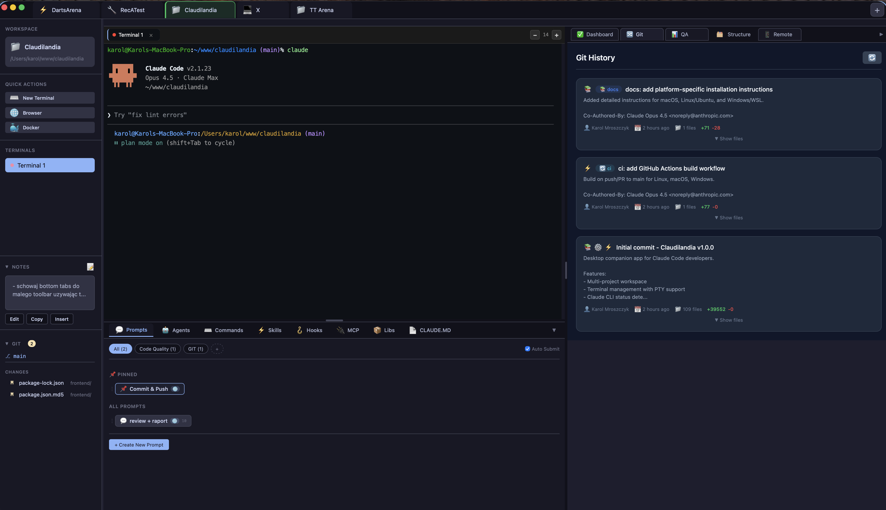

# Claudilandia

A powerful desktop companion app for [Claude Code](https://claude.ai/claude-code) developers. Manage multiple projects, terminals, git operations, Docker containers, and more - all in one place.

Built with [Wails](https://wails.io/) (Go + JavaScript). **macOS only.**

## Features

- **Multi-Project Workspace** - Organize and switch between multiple projects with custom colors and icons
- **iTerm2 Integration** - Native iTerm2 control via AppleScript - switch tabs, create terminals, send prompts
- **Claude CLI Integration** - Detects Claude Code CLI status and displays real-time activity
- **Git Dashboard** - View changed files, diffs, commit history, and branch info
- **Docker Integration** - Monitor and control containers for your projects
- **Test Dashboard** - Auto-detect test runs, track results, and monitor coverage trends
- **Remote Access** - Access your terminals remotely via WebSocket with ngrok tunnel support
- **Claude Tools Panel** - Manage agents, skills, commands, hooks, prompts, and MCP servers
- **Project Notes** - Markdown notes per project
- **Screenshots** - Capture and manage project screenshots

## Screenshot



## Installation

### Requirements

- **macOS** 12+ (Monterey or later)
- **iTerm2** installed
- **Go** 1.24+
- **Node.js** 18+
- **Wails CLI** v2.11+

### Build from Source

```bash
# Install Xcode Command Line Tools
xcode-select --install

# Install Go (via Homebrew)
brew install go

# Install Node.js (via Homebrew)
brew install node

# Install Wails CLI
go install github.com/wailsapp/wails/v2/cmd/wails@latest

# Clone and build
git clone https://github.com/kmxsoftware/claudilandia.git
cd claudilandia
cd frontend && npm install && cd ..
wails build

# Run the app
open build/bin/Claudilandia.app
```

## Development

Run in development mode with hot-reload:

```bash
wails dev
```

This starts:
- Go backend with live reload
- Vite dev server for frontend at `http://localhost:34115`

## Project Structure

```
├── main.go              # Application entry point
├── app.go               # Main App struct with all exposed methods
├── internal/
│   ├── iterm/           # iTerm2 AppleScript integration
│   ├── docker/          # Docker API integration
│   ├── git/             # Git operations
│   ├── claude/          # Claude CLI detection & tools
│   ├── remote/          # WebSocket server for remote access
│   ├── state/           # Application state persistence
│   ├── testing/         # Test watcher & coverage
│   ├── structure/       # Project structure scanner
│   └── logging/         # Structured logging with rotation
├── frontend/
│   ├── src/
│   │   ├── main.js      # Frontend entry point
│   │   └── modules/     # Feature modules (iterm, git, docker, etc.)
│   └── package.json
├── build/               # Build configuration & output
└── wails.json           # Wails project configuration
```

## Remote Access

Claudilandia supports remote terminal access via WebSocket:

1. Enable remote access from the app
2. Optionally enable ngrok tunnel for public access
3. Share the generated URL with token
4. Access terminals from any browser

Security features:
- Token-based authentication with expiry
- Permanent approved devices support
- Rate limiting (50 attempts, 1 min lockout)
- Constant-time token comparison
- CORS whitelist (localhost, ngrok domains)

## Configuration

Application data is stored in `~/.claudilandia/`:
- `logs/` - Application logs (3-day retention)
- Project state and settings

## Tech Stack

**Backend:**
- Go 1.24
- Wails v2.11
- gorilla/websocket
- Docker SDK
- AppleScript (iTerm2 automation)

**Frontend:**
- Vanilla JavaScript (ES6 modules)
- Vite 3.0
- marked (Markdown)
- highlight.js (syntax highlighting)

## Why macOS Only?

Claudilandia uses native iTerm2 integration via AppleScript for terminal management. This provides:
- Seamless integration with your existing iTerm2 setup
- Native performance and reliability
- Access to iTerm2's powerful features (split panes, profiles, etc.)

## Contributing

See [CONTRIBUTING.md](CONTRIBUTING.md) for guidelines.

## Security

See [SECURITY.md](SECURITY.md) for reporting vulnerabilities.

## License

MIT License - see [LICENSE](LICENSE) for details.

## Author

**Karol Mroszczyk** - [karol.mroszczyk@gmail.com](mailto:karol.mroszczyk@gmail.com)
